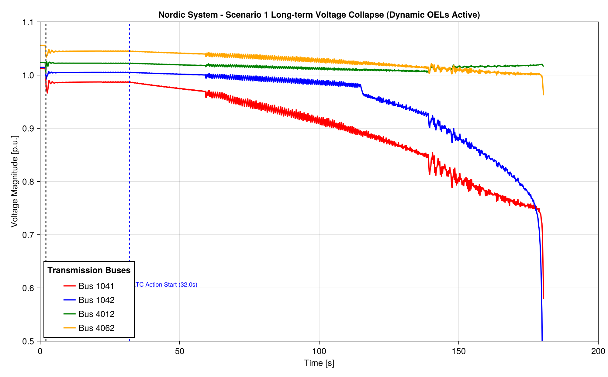
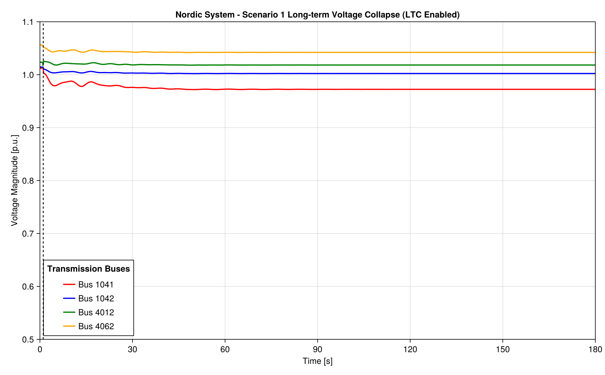
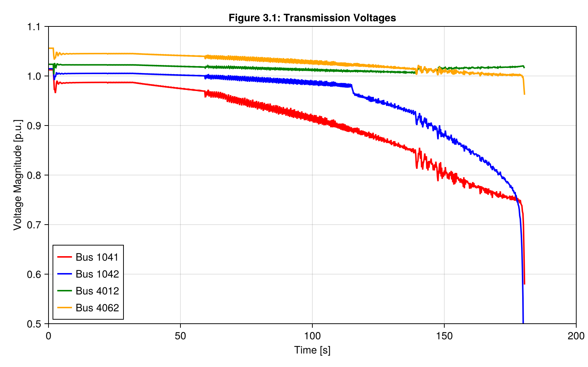
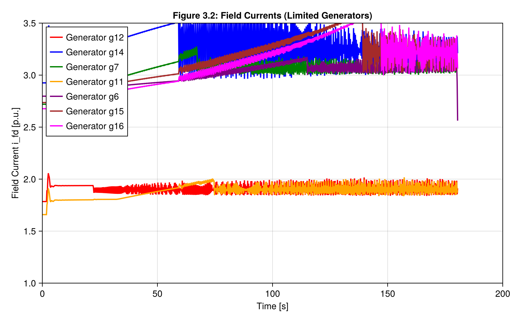

# Nordic Test System - Standalone Julia Simulation

This directory contains the standalone Julia implementation of the IEEE PES-TR19 Nordic test system simulation. It models the long-term voltage stability and voltage collapse phenomena driven by Load Tap Changers (LTC) and Overexcitation Limiters (OEL).

## System and Modeling Configurations

### 1. Network Configuration
- **Model Reference**: IEEE PES-TR19 "Test Systems for Voltage Stability Analysis and Security Assessment" (based on the Swedish transmission grid).
- **Topology**: 74 buses in total:
  - 32 Transmission buses (400 kV, 220 kV, 130 kV)
  - 22 Distribution/Load buses (20 kV)
  - 20 Generator buses (15 kV)

### 2. Dynamic Components
- **Generators**: 
  - Salient-pole hydro generators modeled using `PSSE_GENSAL` (North and Equivalent areas).
  - Round-rotor thermal generators modeled using `PSSE_GENROU` (Central and South areas).
- **Excitation Controllers**: Automatic Voltage Regulators (AVR) integrated with Overexcitation Limiters (OEL) using a dynamic integrator takeover takeover gate.
- **Load Tap Changers (LTC)**: Continuous state-space approximations regulating load-side distribution voltages within a deadband `[0.99, 1.01]` p.u. by modifying transformer tap ratio `m` (with a delay of 30 seconds).
- **Speed Governors & Turbines**: Modeled on hydro generators to regulate frequency (50 Hz).

### 3. Simulation Parameters & Solver
- **Software Stack**: Built using `PowerDynamics.jl`, `NetworkDynamics.jl`, and `ModelingToolkit.jl` in Julia.
- **ODE/DAE Solver**: `OrdinaryDiffEq.jl`'s stiff solver `Rodas5P()` is used.
- **Tolerances**: `reltol = 1e-5`, `abstol = 1e-5`.
- **Fault Scenario 1**:
  - A solid three-phase fault is applied at transmission bus 4032 at $t = 2.0$s.
  - The fault is cleared at $t = 2.1$s by opening transmission corridor line 4032-4044.
  - Total simulation duration is 200 seconds.

---

## Simulation Scripts

- **`nordic_test_system.jl`**: Contains static bus data, line parameters, and steady-state operating point values.
- **`nordic_dynamic_simulation.jl`**: Defines components (`LTCTransformer`, `NordicAVRWithOEL`) and builds the dynamic network grid.
- **`run_nordic_dynamic_scenario1.jl`**: Main entrypoint script to simulate Scenario 1 (voltage collapse) and plot the voltage trajectories.
- **`run_nordic_ltc_scenario1.jl`**: Script to simulate a basic LTC voltage recovery scenario.

---

## Simulation Results

### 1. Scenario 1 - Long-Term Voltage Collapse
The plot below illustrates the long-term voltage collapse under Scenario 1. Following the fault and line trip at $t = 2.0\text{s}$, the system voltage recovers initially but collapses around $t = 180.4\text{s}$ due to the continuous tap-changing actions of LTC transformers trying to restore load consumption, which overrides the generator reactive capability and triggers OEL limits.

### 2. LTC Tap and Load Bus Voltages
The following plot shows the LTC tap ratios `m` adapting to regulate the low-voltage distribution buses.

### 3. Verification Curves (Dynamic Trajectories)
Below are representative curves comparing the variables (Voltage, Field Currents, etc.) to the reference paper benchmarks:

| Transmission Voltages (Fig 3.1) | Generator Field Currents (Fig 3.2) |
|:---:|:---:|
|  |  |
